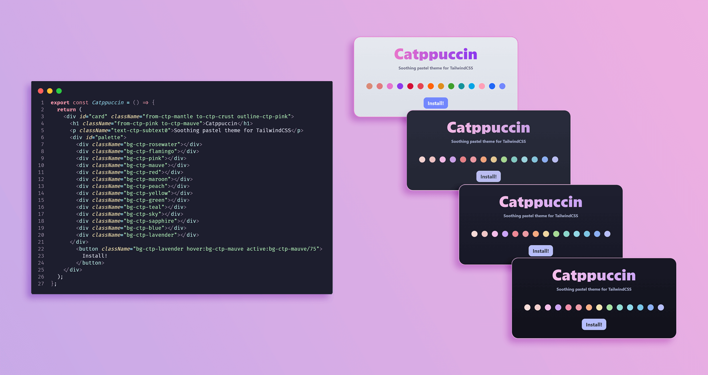

<h3 align="center">
	<br/>
	
	Catppuccin for TailwindCSS
	
</h3>

<p align="center">
    <a href="https://github.com/catppuccin/template/stargazers"></a>
    <a href="https://github.com/catppuccin/template/issues"></a>
    <a href="https://github.com/catppuccin/template/contributors"></a>
</p>

<p align="center">
  
</p>

## Usage

1. Install the npm package

-   with npm:

```bash
npm i -D @adalzanabria/tailwindcss
```

-   with yarn:

```bash
yarn add -D @adalzanabria/tailwindcss
```

2. Add the plugin into your `tailwind.config.js` file

```javascript
plugins: [require("@adalzanabria/tailwindcss")],
```
3. Add an import of the palettes to the first line of your main css file were you use your Tailwind directives:
```bash
@import '@adalzanabria/tailwindcss';
```
- _Note: If you are using TailwindCSS 3.1+ with the CLI, `@import` works out of the box, if you are using TailwindCSS as a PostCSS plugin, you need to install the `postcss-import` plugin and add it to your `postcss.config.js` to be able to use `@import`._

4. Use the colors in any utility class that supports them. All colors are prefixed by the `ctp` keyword, the default palette is _`latte`_. For example:

```html
<p className="text-ctp-mauve">
    This is a paragraph with the color mauve.
</p>
```

```html
<div className="bg-ctp-flamingo">
    This is a div with the background color of flamingo.
</div>
```
5. To use different palettes, add one of the following classes to the container of the elements:
- `theme-frappe`
- `theme-macchiato`
- `theme-mocha`
- If no theme class is used, the `latte` theme will be used as default. For example:
```html
<div>
    <p className="text-ctp-pink">
        This is a paragraph with the color pink of the latte palette.
    </p>
</div>
<div className="theme-frappe">
    <!--All elements inside this div will use the frappe palette.-->
    <p className="text-ctp-pink">
        This is a paragraph with the color pink of the frappe palette.
    </p>
</div>
<div className="theme-macchiato">
    <!--All elements inside this div will use the macchiato palette.-->
    <p className="text-ctp-pink">
        This is a paragraph with the color pink of the macchiato palette.
    </p>
</div>
<div className="theme-mocha">
    <!--All elements inside this div will use the mocha palette.-->
    <p className="text-ctp-pink">
        This is a paragraph with the color pink of the mocha palette.
    </p>
</div>
```

6. Using the `Tailwind CSS IntelliSense` extension for VS Code is adviced to preview the class names, but not necessary.

## 🙋 FAQ (optional)

-   Q: **_"Will I be able to use the regular colors that come with Tailwind CSS after installing this plugin?"_**

    A: Yes, this plugin only extends the original colors and you can still add your own in the `tailwind.config.js` file like you normally would.

-   Q: **_"Colors are not working!"_**

    A: This plugin was made for Tailwind CSS 3.0+, previous versions may not work.

## 💝 Thanks to

-   [Adal Zanabria](https://github.com/AdalZanabria)

&nbsp;

<p align="center"></p>
<p align="center">Copyright &copy; 2021-present <a href="https://github.com/catppuccin" target="_blank">Catppuccin Org</a>
<p align="center"><a href="https://github.com/catppuccin/catppuccin/blob/main/LICENSE"></a></p>
